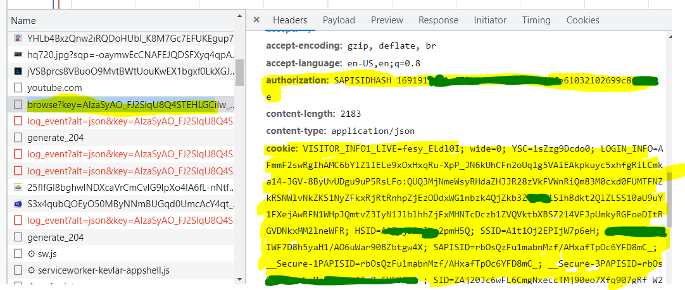

# PHP BASED YT SCRAPPER

### Features
 - GET HomePage Videos
 - GET Video Info + Video Related Recomended Videos
 - GET Video Playable links
 - GET Search Video + load more videos
 - GET Channel Meta Info
 - GET Channel Featured , Videos , Shorts & Playlist
 - GET Video Comments
 - GET Comment Replys


## how to
 just download the yt.php , include it and enjoy!
 for example checkout index.php & example2.php

```
    include_once("./yt.php");

    $youtube = new YT();      
    echo json_encode($youtube->search("WordPress+Tutorail")); // search query with '+' sign no space
    echo json_encode($youtube->HomePageVideos());  // get youtube home page Array
    echo json_encode($youtube->getRelatedVideo('GlLRYml8mCY')); // pass videoId get an array of videos
  
   // pass videoId get a video object and related videos Array
    echo json_encode($youtube->getVideo('GlLRYml8mCY'));  
  
   //  pass channelId , channelId can be obtained from getVideo function in video object 
    echo json_encode($youtube->getChannelFeatured('UC8aFE06Cti9OnQcKpl6rDvQ'));
    echo json_encode($youtube->getChannelVideos('UC8aFE06Cti9OnQcKpl6rDvQ'));
    echo json_encode($youtube->getChannelShorts('UC8aFE06Cti9OnQcKpl6rDvQ'));
    echo json_encode($youtube->getChannelPlayList('UC8aFE06Cti9OnQcKpl6rDvQ'));
    echo json_encode($youtube->getChannelMetaDetails('UC8aFE06Cti9OnQcKpl6rDvQ'));

    // commentToken is Obtained from getVideo function
    // echo json_encode($youtube->getComments(Comment_token_here));
    // echo json_encode($youtube->getReplyComments(Reply_Comment_Token_Here));


```


## Authorization
  
  To get videos related to your Youtube account u need to be logged in
  now in order to that we need a Acccount Authorization key and users cookie
  so here are the steps

  #### Step1
   Open youtube.com with inspector open

  #### Step2 
    Go to Networks Tab Search for a Request called browser?key=xxxxwhatEverkeyherexxxx
    click it when find it if , doesnt reload page

  #### Step3
    In Headers Tab Scroll Down and find authorization and cookie value , then copy it 
    to your .env file;
    paste in as Variable you like AUTHORIZATION and COOKIE
    ```
     AUTHORIZATION="SAPISIDHASH xxxxxx......xxxx....xxx"
     COOKIE="VISITOR_INFO1_LIVE=fesy_ELdl0I; wide=0; YSCxxxx......"
    ```

    

 ```
   // Authorization of Youtube 
   $env = parse_ini_file('.env');
   $authorization = $env['AUTHORIZATION'] ;
   $cookie = $env['COOKIE'];

   echo json_encode($youtube->HomePageVideosWithAuth($authorization,$cookie));

 ```


### Todo
 - load more videos [for methods like homepagevideos , relatedvideos]
 - video playable link speed increase
